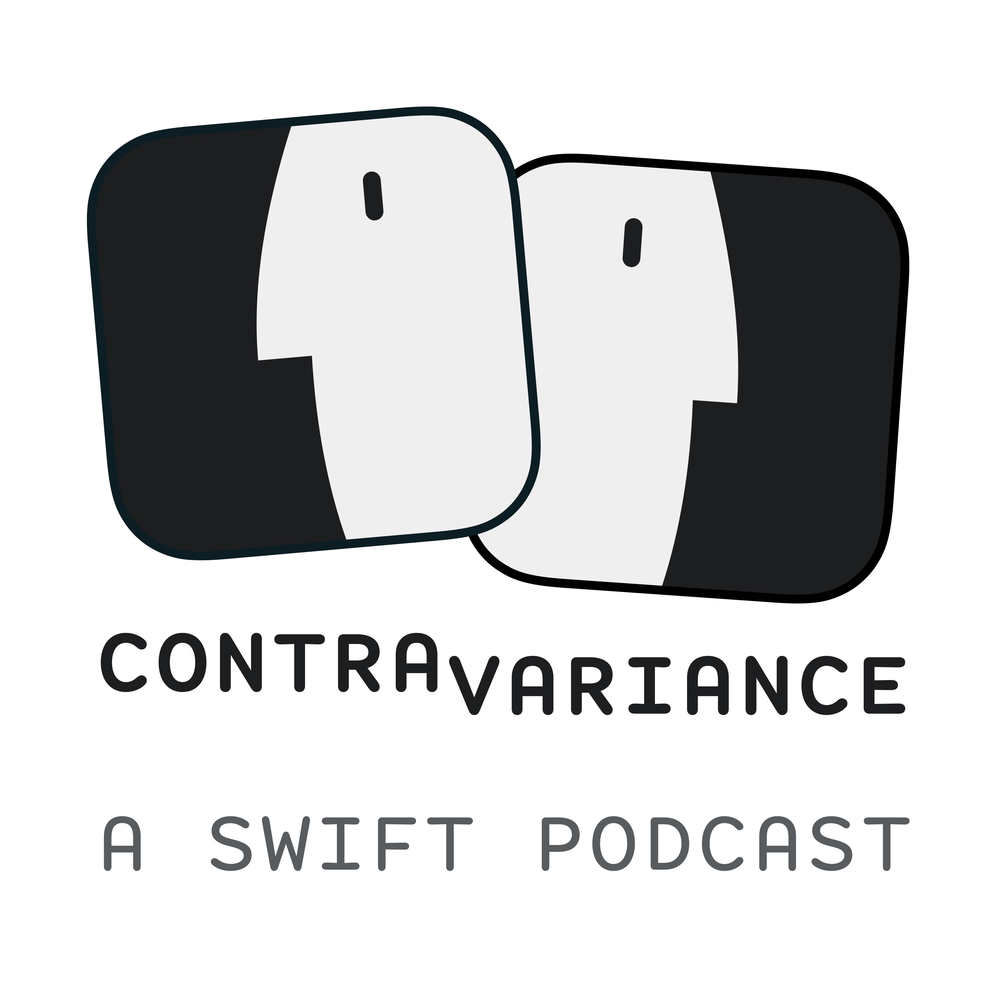

<p align="center">
  <strong>Listen on <a href="https://itunes.apple.com/us/podcast/contravariance-a-swift-podcast/id1423771323">iTunes</a> | <a href="https://overcast.fm/itunes1423771323/contravariance-a-swift-podcast">Overcast</a> | <a href="https://pca.st/QjR1">Pocket Casts</a></strong>
</p>
<p align="center">
  
</p>

# Contravariance
### https://contravariance.rocks

Contravariance is podcast by [Benedikt Terhechte](https://twitter.com/terhechte) and [Bas Broek](https://twitter.com/BasThomas).

The podcast's website, feed and artwork material can be found in this repository.

# Building the Site

```
./masse.swift ./config.bacf
```
